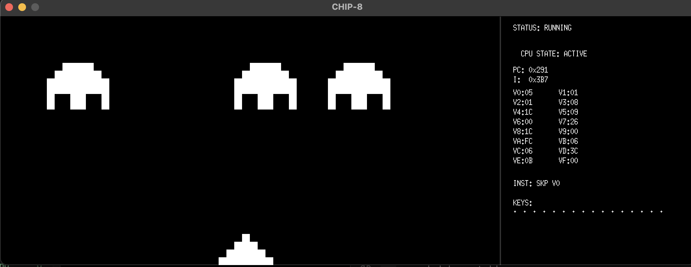
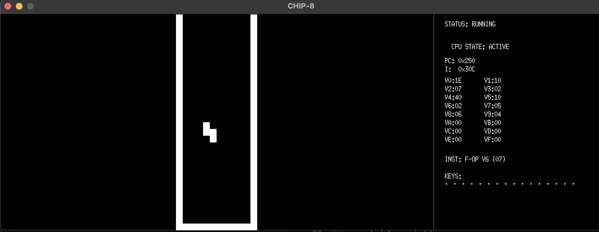
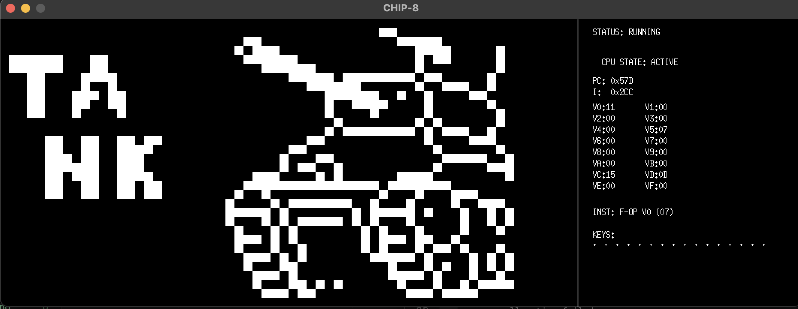
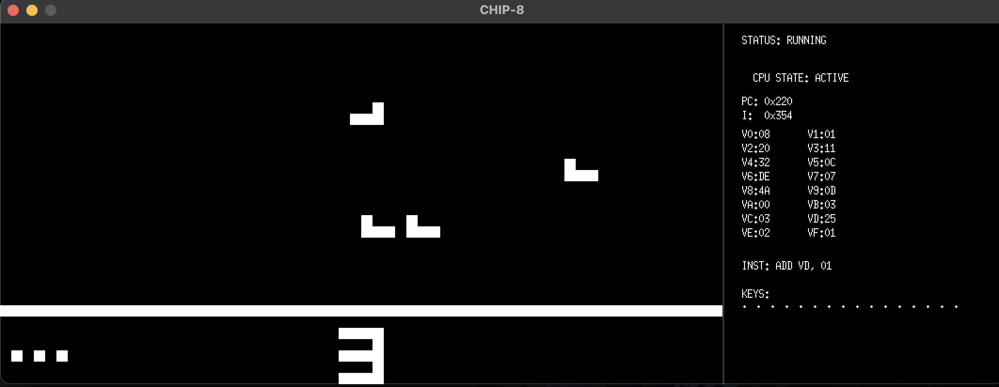

# CHIP-8 Go Runtime

[](https://github.com/YOUR_USERNAME/chip8-go-runtime/actions)


A hardened, high-performance CHIP-8 execution environment written in Go. Featuring XOR rendering, an idiomatic table-driven test suite, and a specialized WebAssembly (WASM) distribution.


## How to Run

### Option A: Web (Instant)
Visit the [Live Demo](https://itsVinM.github.io/chip8-go-runtime/) to run the runtime directly in your browser via WebAssembly.

### Option B: Local Desktop
### Prerequisites
- **Go 1.22+** (Uses `math/rand/v2` for high-performance PRNG)
- **MacOS** (Optimized for Apple Silicon / MacBook Air)

### Installation
1. Initialize the module and fetch dependencies:
   ```bash
   go mod init chip8
   go get [github.com/hajimehoshi/ebiten/v2](https://github.com/hajimehoshi/ebiten/v2)
   go mod tidy

## 🛠 Engineering & Quality Assurance

This implementation prioritizes **System Resiliency** and **Observability**. By applying principal engineering patterns, the emulator functions as a hardened runtime rather than a simple interpreter.

### Automated Testing & Regression
The project includes a comprehensive test suite designed to ensure hardware parity and prevent regression during optimization:

* **Dynamic Integration Suite:** A specialized test runner that crawls the `rom/` directory, dynamically loading and executing every ROM in the collection to verify initial stability.
* **Arithmetic & Flow Validation:** Unit tests covering the "Golden Path" for carry-flags, borrowing, and jump logic.
* **Fault Injection & Bounds Safety:** * The CPU is hardened against "malicious" or corrupt ROMs. 
    * Instead of allowing a Go `panic` on out-of-bounds memory access (e.g., `0xDxyn` sprite drawing), the emulator detects the violation and enters a **Graceful Halt** state.
    * **Illegal Opcode Detection:** Invalid instructions are trapped, halting execution and logging the offending state for debugging.
To execute the full validation suite and ROM regression tests:
```bash
go test -v ./lib
```

```bash
=== RUN   TestAllOpcodes
=== RUN   TestAllOpcodes/Arithmetic:_8xy4_(ADD_with_Carry)
=== RUN   TestAllOpcodes/Arithmetic:_8xy5_(SUB_with_Borrow)
=== RUN   TestAllOpcodes/Flow:_1nnn_(Jump)
=== RUN   TestAllOpcodes/Flow:_3xkk_(Skip_if_Equal_-_True)
=== RUN   TestAllOpcodes/memory:_Annn_(Load_Index)
=== RUN   TestAllOpcodes/Graphics:_Dxyn_(Word-Level_XOR_Draw)
=== RUN   TestAllOpcodes/Fault:_Out_of_Bounds_Index_(Robustness)
=== RUN   TestAllOpcodes/Fault:_Unknown_Opcode_(Graceful_Halt)
[Info] Correctly identified invalid opcode: 5001
--- PASS: TestAllOpcodes (0.00s)
    --- PASS: TestAllOpcodes/Arithmetic:_8xy4_(ADD_with_Carry) (0.00s)
    --- PASS: TestAllOpcodes/Arithmetic:_8xy5_(SUB_with_Borrow) (0.00s)
    --- PASS: TestAllOpcodes/Flow:_1nnn_(Jump) (0.00s)
    --- PASS: TestAllOpcodes/Flow:_3xkk_(Skip_if_Equal_-_True) (0.00s)
    --- PASS: TestAllOpcodes/memory:_Annn_(Load_Index) (0.00s)
    --- PASS: TestAllOpcodes/Graphics:_Dxyn_(Word-Level_XOR_Draw) (0.00s)
    --- PASS: TestAllOpcodes/Fault:_Out_of_Bounds_Index_(Robustness) (0.00s)
    --- PASS: TestAllOpcodes/Fault:_Unknown_Opcode_(Graceful_Halt) (0.00s)
=== RUN   TestRealROMLoad
[Test] Successfully loaded ../rom/tank.ch8. First opcode: 1301
--- PASS: TestRealROMLoad (0.00s)
=== RUN   TestROMCollection
=== RUN   TestROMCollection/8-scrolling.ch8
=== RUN   TestROMCollection/Airplane.ch8
=== RUN   TestROMCollection/Space_Invaders_[David_Winter]_(alt).ch8
=== RUN   TestROMCollection/Tetris.ch8
=== RUN   TestROMCollection/chip8-logo.ch8
=== RUN   TestROMCollection/horseyJump.ch8
=== RUN   TestROMCollection/tank.ch8
=== RUN   TestROMCollection/tombstontipp.ch8
=== RUN   TestROMCollection/trucksimul8or.ch8
--- PASS: TestROMCollection (0.00s)
    --- PASS: TestROMCollection/8-scrolling.ch8 (0.00s)
    --- PASS: TestROMCollection/Airplane.ch8 (0.00s)
    --- PASS: TestROMCollection/Space_Invaders_[David_Winter]_(alt).ch8 (0.00s)
    --- PASS: TestROMCollection/Tetris.ch8 (0.00s)
    --- PASS: TestROMCollection/chip8-logo.ch8 (0.00s)
    --- PASS: TestROMCollection/horseyJump.ch8 (0.00s)
    --- PASS: TestROMCollection/tank.ch8 (0.00s)
    --- PASS: TestROMCollection/tombstontipp.ch8 (0.00s)
    --- PASS: TestROMCollection/trucksimul8or.ch8 (0.00s)
PASS
ok      chip8/lib       (cached)
````

###  System Observability (The Debugger)
To assist in development and ROM analysis, a real-time debugger is integrated into the engine:
* **Live Disassembler:** High-level translation of raw opcodes into human-readable assembly.
* **Hardware State Visualization:** Real-time monitoring of V-Registers, PC, I-Register, and Timers.
* **Input Monitoring:** Visual feedback of the 16-key hex keypad state.
* **Fault Reporting:** Immediate visual feedback in the UI when a CPU Halt is triggered, displaying the specific error (e.g., `MEM FAULT` or `UNKNOWN OPCODE`).

### Compatibility Gallery
The following titles have been verified for graphical accuracy and timing consistency across the automated test suite.

| | |
| :---: | :---: | 
|  |  | 
| **Space Invaders** | **Tetris** | 
| |  | 
|**Tank** |  **Airplane**  |
